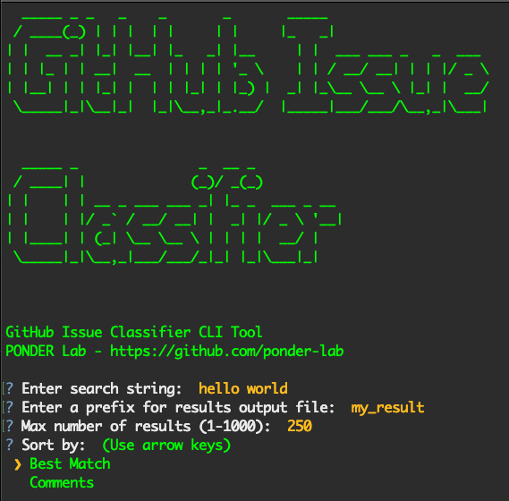

# GitHub-Issue-Mining
[](https://www.travis-ci.com/ponder-lab/GitHub-Issue-Mining)

Python script to mine for GitHub issues + comments and classify them.



## Setup:
1) Ensure Python `3.9.1` and corrosponding pip `3.9` are installed
2) Install requirements: `pip3.9 install -r requirements.txt`
3) Download nltk stop word packages (only need to do it once per environment)
   - Download `nltk` stop words packages `wordnet` and `stopwords` via the python terminal
   ```aidl
    > import nltk
    > nltk.download('wordnet')
    > nltk.download('stopwords')
    ```
    - If you run intl SSL error, make sure python ssl certificates are installed: `bash /Applications/Python\ 3.9/Install\ Certificates.command `
4) Add a GitHub Personal Access Token in the access token file: `access_token.json`. Replace `<YOUR_GITHUB_PERSONAL_ACCESS_TOKEN>` with your token.
   
Instructions on how to create a GitHub Personal Access Token: https://docs.github.com/en/github/authenticating-to-github/creating-a-personal-access-token
 
## Run Instructions:

There are two ways to run this program, either through the interactive command line, or by directly passing in command line argument via `argparser`:

Below is the `-h` help/man page:
```aidl
Usage: mine-issues.py [-h] [-i] [-v] [-m MAX_RESULTS] [-s SORT_BY] [-p PREFIX_FILENAME] query

positional arguments:
  query

optional arguments:
  -h, --help            show this help message and exit
  -i, --interactive       **toggle the interactive CLI**
  -v, --verbose         print additional logs
  -m MAX_RESULTS, --max-results MAX_RESULTS
                        (int) max results to query
  -s SORT_BY, --sort-by SORT_BY
                        sort by one of: [comments, best-match]
  -p PREFIX_FILENAME, --prefix-filename PREFIX_FILENAME
                        (string) file name prefix for result output files
```

### Usage:
Run `python3.9 mine-issues.py <QUERY>` with the following optional parameters:

`-i` or `--interface`: will cause the script to trigger the interactive CLI and ignore all other params. See screenshot above of the interface.

`-v` or `--verbose`: will print out extra logging such as printing out the entire result object in neat JSON format.

`-m` or `--max-results`: filter the number of results we want to retrieve from the search query (1000 by default).

`-s` or `--sort-by`: Pick either `comments` or `best-match` to sort the search query result by (`comments` by default).

`-p` or `--prefix-filename`: String to prefix to the resulting file name (`results_` by default).

## Testing
Running tests to ensure that the script is functioning properly. Travis CI build also runs this as part of build status checks.
1) Ensure that `pytest` is properly set up for your python `3.9` env.
2) Simply run `pytest` to check that all tests are passing.

## Folder Structure
`/models` - Contains the serialized files of the classification model.

`/utils` - Contains utility function files, such as IO, filtering results and processing comments.

`/test` - Contains test file being ran by `pytest`.

`/result` - Folder to output result files to. Contains a `.gitignore` to ignore all files in this folder to prevent results from being committed.

`/config` - Contains configuration files for the app to run, such as the personal access token.